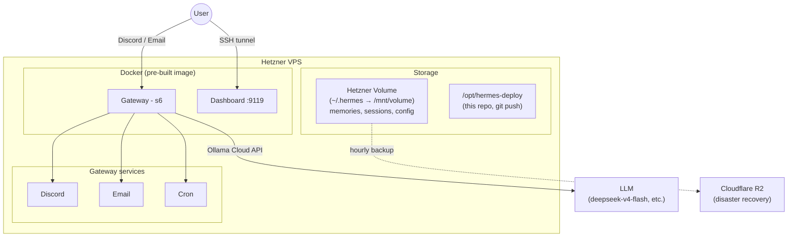

# Hermes Deploy

Personal deployment of [Hermes Agent](https://github.com/nousresearch/hermes-agent) on Hetzner Cloud, managed with Terraform.

Hermes is a self-improving AI agent with persistent memory, skills, and multi-platform messaging. This repo provides a reproducible, one-command deployment with custom agent profiles.

## Architecture



### How it works

Terraform manages three layers, each independently updatable:

| Layer | What | Triggers rebuild? |
|-------|------|-------------------|
| **cloud-init** | Docker install, volume mount | Only on server size/region change |
| **setup script** | Clone repos, pull image, configure docker-compose | On config changes (re-runs over SSH, no rebuild) |
| **profiles script** | Deploy SOUL.md, himalaya config | On profile changes (re-runs over SSH, no rebuild) |

Data lives on a **Hetzner Volume** that persists across server rebuilds, with **hourly R2 backups** for disaster recovery.

## Profiles

Agent personalities live in `profiles/`. Each profile has a `SOUL.md` that defines its character.

| Profile | Personality | Description |
|---------|------------|-------------|
| `default` | **Claudiano** (Claudio Bisio) | Warm, witty, Italian slips when surprised |
| `researcher` | **Barbero** (Alessandro Barbero) | Narrative historian, structured reports, ironic |

Create your own by adding a directory under `profiles/` with a `SOUL.md`.

## Prerequisites

- [Terraform](https://developer.hashicorp.com/terraform/downloads) >= 1.5
- A [Hetzner Cloud](https://www.hetzner.com/cloud) account + API token
- An [Ollama](https://ollama.com) cloud account + API key
- A [Cloudflare](https://dash.cloudflare.com) account with R2 enabled (for remote state + backups)
- A [Discord](https://discord.com/developers/applications) bot token (optional)
- A Gmail app password for email reading (optional)

## Quick Start

### 1. Fork and clone

```bash
# Fork this repo on GitHub, then:
git clone git@github.com:YOUR-USER/hermes-deploy.git
cd hermes-deploy/terraform
cp terraform.tfvars.example terraform.tfvars
```

### 2. Create a deploy key

This lets your Hermes agent push changes back to your repo (self-modification).

```bash
ssh-keygen -t ed25519 -f hermes_deploy_key -N '' -C 'hermes-deploy-key'
```

Add the **public** key (`hermes_deploy_key.pub`) to your GitHub fork:
**Settings → Deploy Keys → Add deploy key** (enable "Allow write access").

Copy both keys into `terraform.tfvars`:
- `deploy_key` — contents of `hermes_deploy_key` (private)
- `deploy_public_key` — contents of `hermes_deploy_key.pub`

### 3. Set up Cloudflare R2

Create two R2 buckets in the [Cloudflare dashboard](https://dash.cloudflare.com) (EU region):
- `hermes-tfstate` — for Terraform remote state
- `hermes-backups` — for hourly data backups

Create an R2 API token with **Object Read & Write** access to both buckets. Then create `.envrc` in the repo root:

```bash
export AWS_ACCESS_KEY_ID="your-r2-access-key"
export AWS_SECRET_ACCESS_KEY="your-r2-secret-key"
```

Load with `source .envrc` or install [direnv](https://direnv.net/).

Update the `backend "s3"` endpoint in `terraform/main.tf` with your Cloudflare account ID.

Add the same R2 credentials to `terraform.tfvars` as `r2_access_key_id` and `r2_secret_access_key`.

### 4. Configure

Edit `terraform.tfvars`. Required variables:

| Variable | Where to get it |
|----------|----------------|
| `hetzner_token` | [Hetzner Console](https://console.hetzner.cloud) → Security → API Tokens |
| `ssh_public_key` | `cat ~/.ssh/id_ed25519.pub` |
| `ollama_api_key` | [ollama.com](https://ollama.com) account settings |
| `deploy_repo` | `git@github.com:YOUR-USER/hermes-deploy.git` |
| `deploy_key` | Private key from step 2 |
| `deploy_public_key` | Public key from step 2 |
| `r2_access_key_id` | From step 3 |
| `r2_secret_access_key` | From step 3 |
| `user_timezone` | Your [IANA timezone](https://en.wikipedia.org/wiki/List_of_tz_database_time_zones) (e.g. `Europe/Berlin`) |

Optional: `discord_bot_token`, `discord_allowed_users`, `email_accounts`.

### 5. Deploy

```bash
cd terraform
terraform init
terraform apply
```

**Takes ~3 minutes.** Uses a pre-built Docker image from Docker Hub — no local build needed.

The deploy runs three stages:
1. Creates server + attaches volume (~30s)
2. Runs setup script over SSH: pulls image, clones repos, starts containers (~2 min)
3. Deploys profiles: copies SOUL.md files, configures himalaya, restarts gateway (~10s)

### 6. Access

```bash
# SSH into the server
ssh root@$(terraform output -raw server_ip)

# Dashboard (web UI) — accessible via SSH tunnel only
ssh -L 9119:127.0.0.1:9119 root@$(terraform output -raw server_ip)
# Then open http://localhost:9119
```

## Choosing a Model

Hermes uses [Ollama Cloud](https://ollama.com) as the LLM provider. Set `ollama_model` in `terraform.tfvars`.

| Model | Best for | Notes |
|-------|----------|-------|
| `deepseek-v4-flash` | General use (recommended) | Fast, strong reasoning, good at multi-step tool use |
| `gemma4:31b` | General use | Good quality, Google model |
| `gemma3:4b` | Testing only | Free/cheap, but too small for reliable tool use or persona adherence |
| `deepseek-v4-pro` | Complex reasoning | Slower, more expensive |

Start with `deepseek-v4-flash` — it handles agentic workflows (tool calls, pagination, multi-step tasks) well. Smaller models struggle with tool use and may ignore the SOUL.md personality.

Check available models:
```bash
curl -H "Authorization: Bearer $OLLAMA_API_KEY" https://ollama.com/v1/models
```

## Email Setup

Hermes uses [himalaya](https://github.com/pimalaya/himalaya) for reading email via IMAP (read-only, no sending).

### Gmail app password

1. Enable [2-Step Verification](https://myaccount.google.com/signinandsecurity) on your Google account
2. Go to [App Passwords](https://myaccount.google.com/apppasswords)
3. Create a new app password (name it "Hermes")
4. Copy the 16-character password

See [Google's documentation](https://support.google.com/accounts/answer/185833) for details.

### Configuration

Add accounts in `terraform.tfvars`:

```hcl
email_accounts = [
  {
    name      = "gmail"
    email     = "you@gmail.com"
    password  = "abcd efgh ijkl mnop"  # app password from above
    imap_host = "imap.gmail.com"
    default   = true
  },
]
```

Supports any IMAP provider — just change `imap_host` (e.g. `outlook.office365.com` for Outlook, `imap.mail.yahoo.com` for Yahoo).

Multiple accounts are supported — the agent can switch between them.

## Self-Modification

This repo is cloned onto the server at `/opt/hermes-deploy`. The default agent (Claudiano) has instructions in its SOUL.md to manage the deployment:

- **Edit profiles** — update SOUL.md, create new profiles
- **Copy to live** — changes take effect immediately
- **Commit and push** — changes are versioned and survive redeploys

Ask your agent "update your personality to be more formal" or "create a new profile for coding help" — it will edit the files, copy to the live location, commit, and push.

The deploy key is scoped to this single repo only.

## Customizing Profiles

Replace the included profiles with your own. The `profiles/default/SOUL.md` is your main agent.

### Adding a new profile

1. Create `profiles/<name>/SOUL.md` with the personality
2. Optionally add `profiles/<name>/profile.yaml` with a description
3. Commit and push
4. Run `terraform apply` or ask your agent to pull the changes
5. On Discord, use `/profile <name>` to switch

### SOUL.md tips

- Define the agent's name, tone, and quirks
- Set language rules (which language to reply in)
- Add structured output formats for specialized profiles (e.g. research reports)
- Keep it concise — the model reads this on every message

## Data Persistence

```
┌─────────────────────────────────┐
│  Hetzner Volume (10GB, €0.50/m) │
│  ~/.hermes/                     │
│  ├── memories/                  │
│  ├── sessions/                  │
│  ├── config.yaml                │
│  ├── profiles/                  │
│  └── skills/                    │
└────────────┬────────────────────┘
             │ hourly rclone sync
             ▼
┌─────────────────────────────────┐
│  Cloudflare R2 (free)           │
│  hermes-backups/latest/         │
└─────────────────────────────────┘
```

- **Volume**: survives server rebuilds (`terraform apply`). All Hermes data lives here.
- **R2 backup**: disaster recovery. Hourly sync via rclone cron. If the volume is lost, restore from R2.

## Project Structure

```
hermes-deploy/
├── README.md
├── .envrc                              # R2 credentials (gitignored)
├── .gitignore
├── TODO.md
├── profiles/
│   ├── default/
│   │   └── SOUL.md                     # Default agent personality
│   └── researcher/
│       ├── SOUL.md                     # Researcher personality
│       └── profile.yaml               # Profile metadata
└── terraform/
    ├── main.tf                         # Provider, backend, resources
    ├── variables.tf                    # All inputs
    ├── outputs.tf                      # IP, SSH, tunnel commands
    ├── cloud-init.yaml                 # Minimal: Docker + volume mount
    ├── himalaya.toml.tftpl             # Email config template
    ├── terraform.tfvars                # Your secrets (gitignored)
    ├── terraform.tfvars.example        # Template for new users
    └── scripts/
        ├── setup-hermes.sh             # Pull image, configure, start
        ├── deploy-profiles.sh          # Deploy SOUL.md + himalaya config
        └── setup-backups.sh            # R2 backup cron via rclone
```

## Troubleshooting

### Bot replies twice to every message

The Hermes image runs an s6 supervisor that starts a gateway. If the Docker CMD also starts one, you get duplicates. This repo sets CMD to `sleep infinity` via `docker-compose.override.yml` and disables the reconcile-profiles script in the dashboard container. Check with:

```bash
docker exec hermes ps aux | grep "hermes gateway" | grep -v grep
```

Should show exactly one `hermes gateway run` process.

### Bot doesn't use the SOUL.md personality

- **Small models** (gemma3:4b) often ignore system prompts. Use `deepseek-v4-flash` or larger.
- Check the file: `docker exec hermes cat /opt/data/SOUL.md`
- SOUL.md is loaded per-message — no restart needed after editing.

### Himalaya email errors

- **"config not found"**: run `docker exec hermes ln -sf /opt/data/.config/himalaya /opt/data/home/.config/himalaya`
- **TOML parse error**: use `backend.encryption.type = "tls"` not `backend.encryption = "tls"`

### SSH key not working after redeploy

A redeploy creates a new server with a new host key:

```bash
ssh-keygen -R $(terraform output -raw server_ip)
```

### Dashboard not loading

The dashboard is on port **9119** (not 7860):

```bash
ssh -L 9119:127.0.0.1:9119 root@$(terraform output -raw server_ip)
```

### Gateway not starting after deploy

If Discord doesn't connect, the gateway service may need a manual start:

```bash
docker exec hermes /command/s6-svc -u /run/service/gateway-default
```

Check logs: `docker exec hermes cat /opt/data/logs/gateway.log | tail -20`

## Costs

| Service | Cost |
|---------|------|
| Hetzner VPS | ~€5-8/month (cx22/cx23) |
| Hetzner Volume | ~€0.50/month (10GB) |
| Ollama Cloud | Pay-per-use (model dependent) |
| Cloudflare R2 | Free (10GB storage, no egress) |
| Discord / Email | Free |
