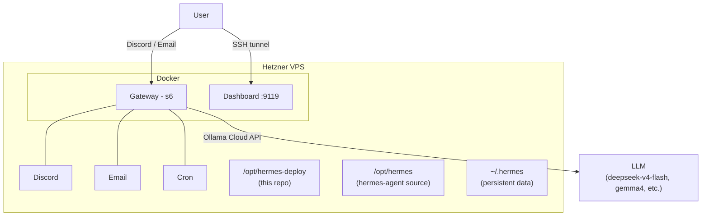

# Hermes Deploy

Personal deployment of [Hermes Agent](https://github.com/nousresearch/hermes-agent) on Hetzner Cloud, managed with Terraform.

Hermes is a self-improving AI agent with persistent memory, skills, and multi-platform messaging. This repo provides a reproducible, one-command deployment with custom agent profiles.

## Architecture



## Profiles

Agent personalities live in `profiles/`. Each profile has a `SOUL.md` that defines its character.

| Profile | Personality | Description |
|---------|------------|-------------|
| `default` | **Claudiano** (Claudio Bisio) | Sarcastic, warm, Italian slips when surprised |
| `researcher` | **Barbero** (Alessandro Barbero) | Narrative historian, structured reports, ironic |

Create your own by adding a directory under `profiles/` with a `SOUL.md`.

## Prerequisites

- [Terraform](https://developer.hashicorp.com/terraform/downloads) >= 1.5
- A [Hetzner Cloud](https://www.hetzner.com/cloud) account + API token
- An [Ollama](https://ollama.com) cloud account + API key
- A [Discord](https://discord.com/developers/applications) bot token (optional)
- A Gmail app password for email reading (optional)
- A [Cloudflare R2](https://developers.cloudflare.com/r2/) bucket for remote state (optional)

## Quick Start

### 1. Clone and configure

```bash
git clone https://github.com/francescomucio/hermes-deploy.git
cd hermes-deploy/terraform
cp terraform.tfvars.example terraform.tfvars
# Edit terraform.tfvars with your credentials
```

### 2. Set up remote state (optional)

Create a Cloudflare R2 bucket named `hermes-tfstate`, then create a `.envrc` in the repo root:

```bash
export AWS_ACCESS_KEY_ID="your-r2-access-key"
export AWS_SECRET_ACCESS_KEY="your-r2-secret-key"
```

Load it with `source .envrc` or install [direnv](https://direnv.net/).

If you skip remote state, remove the `backend "s3"` block from `terraform/main.tf`.

### 3. Deploy

```bash
cd terraform
terraform init
terraform apply
```

This provisions a Hetzner VPS, installs Docker, builds Hermes, configures your profiles, and starts the gateway. Takes ~12 minutes.

### 4. Access

```bash
# SSH into the server
ssh root@$(terraform output -raw server_ip)

# Dashboard (web UI)
ssh -L 9119:127.0.0.1:9119 root@$(terraform output -raw server_ip)
# Then open http://localhost:9119
```

## Email Setup

Hermes uses [himalaya](https://github.com/pimalaya/himalaya) for email. Configure accounts in `terraform.tfvars`:

```hcl
email_accounts = [
  {
    name      = "gmail"
    email     = "you@gmail.com"
    password  = "your-app-password"  # Gmail: myaccount.google.com/apppasswords
    imap_host = "imap.gmail.com"
    default   = true
  },
]
```

Supports any IMAP provider — just change `imap_host`.

## Self-Modification

This repo is cloned onto the server at `/opt/hermes-deploy`. Hermes has full git access and can:

- Edit profiles and SOUL.md files
- Modify configuration
- Push changes back to this repo

This enables the agent to improve its own setup over time.

## Adding a Profile

1. Create `profiles/<name>/SOUL.md` with the personality
2. Optionally add `profiles/<name>/profile.yaml` with metadata
3. Commit and push — on next deploy, the profile is available

## Project Structure

```
hermes-deploy/
├── README.md
├── .envrc                        # R2 credentials (gitignored)
├── .gitignore
├── profiles/
│   ├── default/
│   │   └── SOUL.md               # Claudiano personality
│   └── researcher/
│       ├── SOUL.md               # Barbero researcher personality
│       └── profile.yaml          # Profile metadata
└── terraform/
    ├── main.tf                   # Provider, backend, server
    ├── variables.tf              # All inputs
    ├── outputs.tf                # IP, SSH, tunnel commands
    ├── cloud-init.yaml           # Server bootstrap script
    ├── himalaya.toml.tftpl       # Email config template
    ├── terraform.tfvars          # Your secrets (gitignored)
    └── terraform.tfvars.example  # Template for new users
```

## Costs

- **Hetzner VPS**: ~€5-8/month (cx22/cx23)
- **Ollama Cloud**: pay-per-use (model dependent)
- **Cloudflare R2**: free (10GB included)
- **Discord/Email**: free
