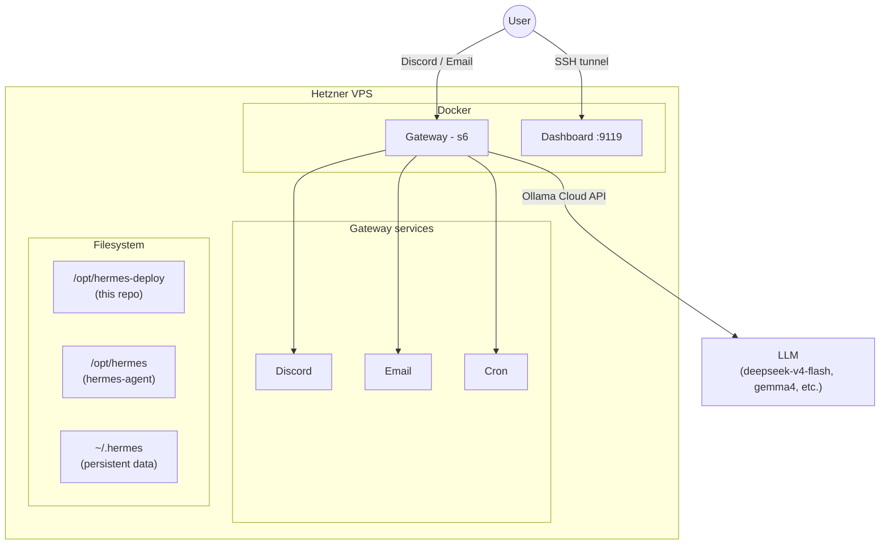

# Hermes Deploy

Personal deployment of [Hermes Agent](https://github.com/nousresearch/hermes-agent) on Hetzner Cloud, managed with Terraform.

Hermes is a self-improving AI agent with persistent memory, skills, and multi-platform messaging. This repo provides a reproducible, one-command deployment with custom agent profiles.

## Architecture



## Profiles

Agent personalities live in `profiles/`. Each profile has a `SOUL.md` that defines its character.

| Profile | Personality | Description |
|---------|------------|-------------|
| `default` | **Claudiano** (Claudio Bisio) | Sarcastic, warm, Italian slips when surprised |
| `researcher` | **Barbero** (Alessandro Barbero) | Narrative historian, structured reports, ironic |

Create your own by adding a directory under `profiles/` with a `SOUL.md`.

## Prerequisites

- [Terraform](https://developer.hashicorp.com/terraform/downloads) >= 1.5
- A [Hetzner Cloud](https://www.hetzner.com/cloud) account + API token
- An [Ollama](https://ollama.com) cloud account + API key
- A [Discord](https://discord.com/developers/applications) bot token (optional)
- A Gmail app password for email reading (optional)
- A [Cloudflare R2](https://developers.cloudflare.com/r2/) bucket for remote state (optional)

## Quick Start

### 1. Fork and clone

```bash
# Fork this repo on GitHub, then:
git clone git@github.com:YOUR-USER/hermes-deploy.git
cd hermes-deploy/terraform
cp terraform.tfvars.example terraform.tfvars
```

### 2. Create a deploy key

This lets your Hermes agent push changes back to your repo.

```bash
ssh-keygen -t ed25519 -f hermes_deploy_key -N '' -C 'hermes-deploy-key'
```

Add the **public** key (`hermes_deploy_key.pub`) to your GitHub fork:
**Settings → Deploy Keys → Add deploy key** (enable "Allow write access").

Paste the **private** key (`hermes_deploy_key`) into `terraform.tfvars` under `deploy_key`.

### 3. Configure

Edit `terraform.tfvars` with your credentials. At minimum you need:

- `hetzner_token` — [Hetzner Cloud Console](https://console.hetzner.cloud) → project → Security → API Tokens
- `ssh_public_key` — your SSH public key (`cat ~/.ssh/id_ed25519.pub`)
- `ollama_api_key` — from [ollama.com](https://ollama.com)
- `deploy_repo` — `git@github.com:YOUR-USER/hermes-deploy.git`
- `deploy_key` — the private key from step 2
- `user_timezone` — your [IANA timezone](https://en.wikipedia.org/wiki/List_of_tz_database_time_zones) (e.g. `Europe/Berlin`, `America/New_York`). The server runs in UTC, but the agent interprets and displays times in your timezone.

Optional: `discord_bot_token`, `email_accounts`.

### 4. Set up remote state (optional)

Create a Cloudflare R2 bucket, then create a `.envrc` in the repo root:

```bash
export AWS_ACCESS_KEY_ID="your-r2-access-key"
export AWS_SECRET_ACCESS_KEY="your-r2-secret-key"
```

Load it with `source .envrc` or install [direnv](https://direnv.net/).

Then uncomment the `backend "s3"` block in `terraform/main.tf` and update the endpoint with your Cloudflare account ID.

If you skip remote state, leave the backend block commented out — Terraform will use local state.

### 5. Deploy

```bash
cd terraform
terraform init
terraform apply
```

This provisions a Hetzner VPS, installs Docker, builds Hermes from source, configures your profiles, and starts the gateway.

**This takes ~12 minutes.** The Docker image build is the slowest part. To monitor progress:

```bash
ssh root@$(terraform output -raw server_ip)
tail -f /var/log/cloud-init-output.log
```

You'll see Docker build steps scrolling (steps 1/32 through 32/32), then container startup. When you see `Container hermes Started`, it's done.

### 6. Access

```bash
# SSH into the server
ssh root@$(terraform output -raw server_ip)

# Dashboard (web UI) — accessible via SSH tunnel only
ssh -L 9119:127.0.0.1:9119 root@$(terraform output -raw server_ip)
# Then open http://localhost:9119
```

## Choosing a Model

Hermes uses [Ollama Cloud](https://ollama.com) as the LLM provider. Set the model in `terraform.tfvars` via `ollama_model`.

| Model | Best for | Notes |
|-------|----------|-------|
| `deepseek-v4-flash` | General use (recommended) | Fast, strong reasoning, good at multi-step tool use |
| `gemma4:31b` | General use | Good quality, Google model |
| `gemma3:4b` | Testing | Free/cheap, but too small for reliable tool use or persona adherence |
| `deepseek-v4-pro` | Complex reasoning | Slower, more expensive |
| `qwen3.5:397b` | Maximum capability | Very large, expensive |

Start with `deepseek-v4-flash` — it handles agentic workflows (tool calls, pagination, multi-step tasks) well. Smaller models like `gemma3:4b` work for basic chat but struggle with tool use and may ignore the SOUL.md personality.

Check available models: `curl -H "Authorization: Bearer $OLLAMA_API_KEY" https://ollama.com/v1/models`

## Email Setup

Hermes uses [himalaya](https://github.com/pimalaya/himalaya) for reading email via IMAP (read-only, no sending).

### Gmail app password

1. Enable [2-Step Verification](https://myaccount.google.com/signinandsecurity) on your Google account
2. Go to [App Passwords](https://myaccount.google.com/apppasswords)
3. Create a new app password (name it "Hermes")
4. Copy the 16-character password

See [Google's documentation](https://support.google.com/accounts/answer/185833) for details.

### Configuration

Add accounts in `terraform.tfvars`:

```hcl
email_accounts = [
  {
    name      = "gmail"
    email     = "you@gmail.com"
    password  = "abcd efgh ijkl mnop"  # app password from step above
    imap_host = "imap.gmail.com"
    default   = true
  },
]
```

Supports any IMAP provider — just change `imap_host` (e.g. `outlook.office365.com` for Outlook, `imap.mail.yahoo.com` for Yahoo).

Multiple accounts are supported — add more entries to the list. Use `default = true` on one. The agent can switch between them.

## Self-Modification

This repo is cloned onto the server at `/opt/hermes-deploy` with a deploy key that has write access to your GitHub fork. The agent can:

- **Edit profiles** — update SOUL.md personalities, create new profiles
- **Modify configuration** — adjust settings, add skills
- **Push changes** — commit and push to GitHub so changes are versioned and survive redeploys
- **Pull updates** — pull changes you make from your local machine

In practice, this means you can ask your agent to "update your personality to be more formal" or "create a new profile for coding help" and it will edit the files, commit, and push — all without you touching the server.

The deploy key is scoped to this single repo and cannot access anything else on your GitHub account.

## Customizing Profiles

The `profiles/default/SOUL.md` is your main agent's personality. Replace it with your own. The included Claudiano and Barbero profiles are examples — make them yours.

### Adding a new profile

1. Create `profiles/<name>/SOUL.md` with the personality
2. Optionally add `profiles/<name>/profile.yaml` with a description
3. Commit and push — on next deploy, the profile is available
4. On Discord, use `/profile <name>` to switch

### SOUL.md tips

- Define the agent's name, tone, and quirks
- Set language rules (which language to reply in)
- Add structured output formats if the profile has a specific purpose (e.g. research reports)
- Keep it concise — the model reads this on every message

## Project Structure

```
hermes-deploy/
├── README.md
├── .envrc                        # R2 credentials (gitignored)
├── .gitignore
├── profiles/
│   ├── default/
│   │   └── SOUL.md               # Claudiano personality
│   └── researcher/
│       ├── SOUL.md               # Barbero researcher personality
│       └── profile.yaml          # Profile metadata
└── terraform/
    ├── main.tf                   # Provider, backend, server
    ├── variables.tf              # All inputs
    ├── outputs.tf                # IP, SSH, tunnel commands
    ├── cloud-init.yaml           # Server bootstrap script
    ├── himalaya.toml.tftpl       # Email config template
    ├── terraform.tfvars          # Your secrets (gitignored)
    └── terraform.tfvars.example  # Template for new users
```

## Troubleshooting

### Deploy seems stuck

The Docker image build takes ~10 minutes. SSH into the server and check:

```bash
tail -f /var/log/cloud-init-output.log
```

If you see Docker build steps scrolling, it's working. If it's stuck at `apt-get`, DNS might be slow — wait a minute.

### Bot replies twice to every message

The Hermes Docker image runs an s6 supervisor that starts a gateway service. If the Docker CMD also starts a gateway, you get two instances. The cloud-init in this repo handles this by setting the CMD to `sleep infinity` and letting s6 manage the gateway. If you're seeing double replies after manual changes, check `docker exec hermes ps aux | grep gateway` — there should be exactly one `hermes gateway run` process.

### Bot doesn't use the SOUL.md personality

- **Small models** (gemma3:4b) often ignore system prompts. Use `deepseek-v4-flash` or larger.
- Check the file is in the right place: `docker exec hermes cat /opt/data/SOUL.md`
- SOUL.md is loaded per-message, no restart needed after editing.

### Himalaya email errors

- **"config not found"**: himalaya looks at `$HOME/.config/himalaya/config.toml`. The container has two HOME paths (`/opt/data` and `/opt/data/home`). The cloud-init symlinks them, but if you've restarted manually, run: `docker exec hermes ln -sf /opt/data/.config/himalaya /opt/data/home/.config/himalaya`
- **TOML parse error on line 5**: check for `backend.encryption.type = "tls"` (correct) vs `backend.encryption = "tls"` (wrong).

### SSH key not working after redeploy

A redeploy creates a new server with a new host key. Clear the old one:

```bash
ssh-keygen -R $(terraform output -raw server_ip)
```

### Dashboard not loading

The dashboard listens on port 9119 (not 7860). Use:

```bash
ssh -L 9119:127.0.0.1:9119 root@$(terraform output -raw server_ip)
```

Then open `http://localhost:9119`.

## Costs

- **Hetzner VPS**: ~€5-8/month (cx22/cx23)
- **Ollama Cloud**: pay-per-use (model dependent, some models are free)
- **Cloudflare R2**: free (10GB included)
- **Discord/Email**: free
