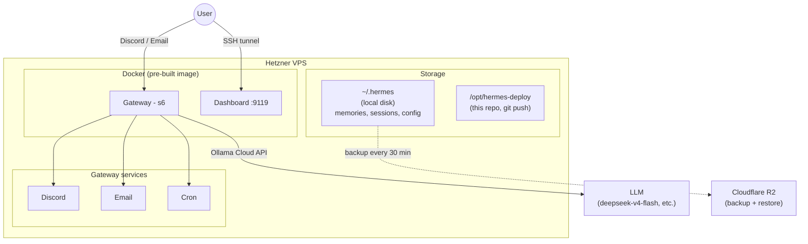

# Hermes Deploy

Personal deployment of [Hermes Agent](https://github.com/nousresearch/hermes-agent) on Hetzner Cloud, managed with Terraform.

Hermes is a self-improving AI agent with persistent memory, skills, and multi-platform messaging. This repo provides a reproducible, one-command deployment with custom agent profiles.

## Architecture



### How it works

Terraform manages three layers, each independently updatable:

| Layer | What | Triggers rebuild? |
|-------|------|-------------------|
| **cloud-init** | Docker install | Only on server size/region change |
| **setup script** | Clone repos, pull image, configure, restore backup | On config changes (re-runs over SSH, no rebuild) |
| **profiles script** | Deploy SOUL.md, himalaya config | On profile changes (re-runs over SSH, no rebuild) |

Data lives on the server's local disk with **R2 backups every 30 minutes**. On redeploy, the latest backup is restored automatically (max 30 min data loss).

## Profiles

Agent personalities live in `profiles/`. Each profile has a `SOUL.md` that defines its character.

| Profile | Personality | Model | Description |
|---------|------------|-------|-------------|
| `default` | **Claudiano** (Claudio Bisio) | `deepseek-v4-flash` | Warm, witty, Italian slips when surprised |
| `coder` | **Eduardo De Filippo** ('o professore) | `qwen3-coder:480b` | Brilliant coder, humble in appearance, theatrical precision |
| `bruno-barbieri` | **Bruno Barbieri** (chef stellato) | `kimi-k2.7-code` | Code reviewer, technical perfectionist, culinary metaphors |
| `calvino` | **Italo Calvino** (Lezioni Americane) | `glm-5.2` | Writing reviewer, lightness, exactitude, visibility |
| `cannavacciuolo` | **Antonino Cannavacciuolo** (chef PM) | `deepseek-v4-flash` | Project/product manager, structured, "Forza e coraggio" |
| `researcher` | **Barbero** (Alessandro Barbero) | `glm-5.2` | Narrative historian, structured reports, ironic |

Create your own by adding a directory under `profiles/` with a `SOUL.md`.

## Prerequisites

- [Terraform](https://developer.hashicorp.com/terraform/downloads) >= 1.5
- A [Hetzner Cloud](https://www.hetzner.com/cloud) account + API token
- An [Ollama](https://ollama.com) cloud account + API key
- A [Cloudflare](https://dash.cloudflare.com) account with R2 enabled (for remote state + backups)
- A [Discord](https://discord.com/developers/applications) bot token (optional)
- A Gmail app password for email reading (optional)

## Quick Start

### 1. Fork and clone

```bash
# Fork this repo on GitHub, then:
git clone git@github.com:YOUR-USER/hermes-deploy.git
cd hermes-deploy/terraform
cp terraform.tfvars.example terraform.tfvars
```

### 2. Create a deploy key

This lets your Hermes agent push changes back to your repo (self-modification).

```bash
ssh-keygen -t ed25519 -f hermes_deploy_key -N '' -C 'hermes-deploy-key'
```

Add the **public** key (`hermes_deploy_key.pub`) to your GitHub fork:
**Settings → Deploy Keys → Add deploy key** (enable "Allow write access").

Copy both keys into `terraform.tfvars`:
- `deploy_key` — contents of `hermes_deploy_key` (private)
- `deploy_public_key` — contents of `hermes_deploy_key.pub`

### 3. Set up Cloudflare R2

Create two R2 buckets in the [Cloudflare dashboard](https://dash.cloudflare.com) (EU region):
- `hermes-tfstate` — for Terraform remote state
- `hermes-backups` — for hourly data backups

Create an R2 API token with **Object Read & Write** access to both buckets. Then create `.envrc` in the repo root:

```bash
export AWS_ACCESS_KEY_ID="your-r2-access-key"
export AWS_SECRET_ACCESS_KEY="your-r2-secret-key"
```

Load with `source .envrc` or install [direnv](https://direnv.net/).

Update the `backend "s3"` endpoint in `terraform/main.tf` with your Cloudflare account ID.

Add the same R2 credentials to `terraform.tfvars` as `r2_access_key_id` and `r2_secret_access_key`.

### 4. Configure

Edit `terraform.tfvars`. Required variables:

| Variable | Where to get it |
|----------|----------------|
| `hetzner_token` | [Hetzner Console](https://console.hetzner.cloud) → Security → API Tokens |
| `ssh_public_key` | `cat ~/.ssh/id_ed25519.pub` |
| `ollama_api_key` | [ollama.com](https://ollama.com) account settings |
| `deploy_repo` | `git@github.com:YOUR-USER/hermes-deploy.git` |
| `deploy_key` | Private key from step 2 |
| `deploy_public_key` | Public key from step 2 |
| `r2_access_key_id` | From step 3 |
| `r2_secret_access_key` | From step 3 |
| `user_timezone` | Your [IANA timezone](https://en.wikipedia.org/wiki/List_of_tz_database_time_zones) (e.g. `Europe/Berlin`) |

Optional: `discord_bot_token`, `discord_allowed_users`, `email_accounts`.

### 5. Deploy

```bash
cd terraform
terraform init
terraform apply
```

**Takes ~3 minutes.** Uses a pre-built Docker image from Docker Hub — no local build needed.

The deploy runs three stages:
1. Creates server + attaches volume (~30s)
2. Runs setup script over SSH: pulls image, clones repos, starts containers (~2 min)
3. Deploys profiles: copies SOUL.md files, configures himalaya, restarts gateway (~10s)

### 6. Access

```bash
# SSH into the server
ssh root@$(terraform output -raw server_ip)

# Dashboard (web UI) — accessible via SSH tunnel only
ssh -L 9119:127.0.0.1:9119 root@$(terraform output -raw server_ip)
# Then open http://localhost:9119
```

### Search proxy tunnel (SOCKS5, opt-in)

Available infrastructure, not part of the default path for anything right now — see
"Camofox Browser Automation" below for why. Opens a reverse SOCKS5 proxy on the server, tunneled
back through your own machine's connection, using the server's existing sshd (no firewall
changes, no extra ports):

```bash
ssh -R 1080 root@$(terraform output -raw server_ip) -N
```

SearXNG's `google` engine has a `proxies: socks5://127.0.0.1:1080` entry that uses this when
it's up — kept for reference, but testing showed it doesn't actually fix Google's CAPTCHA
(blocked with or without it; see below), so don't expect it to help. `duckduckgo`/`wikipedia`/
`github`/news engines never use it and are unaffected either way.

## Choosing a Model

Hermes uses [Ollama Cloud](https://ollama.com) as the LLM provider. Set `ollama_model` in `terraform.tfvars`.

| Model | Best for | Notes |
|-------|----------|-------|
| `deepseek-v4-flash` | General use, PM (recommended) | Fast, strong reasoning, good at multi-step tool use |
| `qwen3-coder:480b` | Coding (Eduardo profile) | Specialized for code generation, 480B |
| `kimi-k2.7-code` | Code review (Bruno profile) | Latest coding specialist, June 2026 |
| `glm-5.2` | Writing review, research (Calvino, Barbero) | Newest model on platform, excellent language understanding |
| `deepseek-v4-pro` | Complex reasoning | Slower, more expensive, 1.6T |

Start with `deepseek-v4-flash` — it handles agentic workflows (tool calls, pagination, multi-step tasks) well. Smaller models struggle with tool use and may ignore the SOUL.md personality.

Check available models:
```bash
curl -H "Authorization: Bearer $OLLAMA_API_KEY" https://ollama.com/v1/models
```

## Email Setup

Hermes uses [himalaya](https://github.com/pimalaya/himalaya) for reading email via IMAP (read-only, no sending).

### Gmail app password

1. Enable [2-Step Verification](https://myaccount.google.com/signinandsecurity) on your Google account
2. Go to [App Passwords](https://myaccount.google.com/apppasswords)
3. Create a new app password (name it "Hermes")
4. Copy the 16-character password

See [Google's documentation](https://support.google.com/accounts/answer/185833) for details.

### Configuration

Add accounts in `terraform.tfvars`:

```hcl
email_accounts = [
  {
    name      = "gmail"
    email     = "you@gmail.com"
    password  = "abcd efgh ijkl mnop"  # app password from above
    imap_host = "imap.gmail.com"
    default   = true
  },
]
```

Supports any IMAP provider — just change `imap_host` (e.g. `outlook.office365.com` for Outlook, `imap.mail.yahoo.com` for Yahoo).

Multiple accounts are supported — the agent can switch between them.

## Self-Modification

This repo is cloned onto the server at `/opt/hermes-deploy`. The default agent (Claudiano) has instructions in its SOUL.md to manage the deployment:

- **Edit profiles** — update SOUL.md, create new profiles
- **Copy to live** — changes take effect immediately
- **Commit and push** — changes are versioned and survive redeploys

Ask your agent "update your personality to be more formal" or "create a new profile for coding help" — it will edit the files, copy to the live location, commit, and push.

The deploy key is scoped to this single repo only.

## Customizing Profiles

Replace the included profiles with your own. The `profiles/default/SOUL.md` is your main agent.

### Adding a new profile

1. Create `profiles/<name>/SOUL.md` with the personality
2. Optionally add `profiles/<name>/profile.yaml` with a description
3. Commit and push
4. Run `terraform apply` or ask your agent to pull the changes
5. On Discord, use `/profile <name>` to switch

### SOUL.md tips

- Define the agent's name, tone, and quirks
- Set language rules (which language to reply in)
- Add structured output formats for specialized profiles (e.g. research reports)
- Keep it concise — the model reads this on every message

## Camofox Browser Automation

[Camofox](https://github.com/jo-inc/camofox-browser) is a self-hosted anti-detection browser
server (Firefox fork with C++-level fingerprint spoofing) that gives Hermes' `browser_navigate`
tools a real, stateful browser — used specifically for sites SearXNG's plain-HTTP engines can't
handle: Reddit (requires an authenticated login, not just IP reputation) and, in principle,
JS-heavy/CAPTCHA-gated sites generally. **Not a reliable Google workaround** — see below.

Runs as its own container (`camofox-browser`), **host-networked** (`--network host`, like
`gateway`/`searxng`, not `docker-compose.override.yml`) — required so `127.0.0.1` inside the
container means the *host's* loopback, where the `hermes` container's API access
(`127.0.0.1:9377`) actually lives. Bound to loopback only at the application level
(`app.listen(PORT, '127.0.0.1', ...)`, patch #6 below) for defense-in-depth, since host
networking removes Docker's own per-container port isolation. Deployed by
`terraform/scripts/setup-hermes.sh`.

**No proxy by default** (`PROXY_HOST`/`PROXY_PORT` unset). This was tried both ways: the search
proxy tunnel doesn't help Google (blocked either way, see below) and isn't needed for Reddit once
the session is persisted (cookies browse fine without it — the proxy only seemed to matter for a
*fresh* login, and even that's confounded by attempt-spacing rather than cleanly isolated to the
proxy itself). Routing through it also has a real cost: it burns the *home* IP's reputation with
whatever site is being accessed, for no confirmed benefit. Revisit empirically if a future Reddit
re-login genuinely needs it — the SOCKS5 proxy support (patch #4 below) is still there, just
unused by default.

**Heap limit**: the image's own default Node startup command caps memory at `MAX_OLD_SPACE_SIZE=128`
(128MB) — too little for real browser + Playwright usage; it OOM-crashed in practice
(`FATAL ERROR: ... JavaScript heap out of memory`, `Aborted (core dumped)`), silently killing
whatever tab/session was active. Raised to `1024` — the box has several GB of headroom to spare.

### Upstream patches

The pinned version (`135.0.1-beta.24`, the Makefile default) has real, currently-unfixed bugs on
Linux/Docker specifically — the buggy code paths are gated behind `os.platform() === 'linux'`,
so they likely don't show up in the maintainer's own (probably macOS-based) testing. All patches
are applied automatically in `setup-hermes.sh`, idempotently, every time the container needs
(re)creating — not just once at clone time, so they self-heal if `/opt/camofox-browser` already
existed from before a patch was added. If `CAMOUFOX_VERSION`/`CAMOUFOX_RELEASE` in the Makefile
ever get bumped, re-check whether these are still needed — an upstream fix landing would make the
corresponding `sed` a silent no-op (fine) or, in the unlikely case upstream changes the
surrounding code shape, a no-op that silently stops applying (re-verify manually).

| # | File | Symptom | Root cause | Fix |
|---|------|---------|------------|-----|
| 1 | `server.js` | Every browser launch fails: `cannot open display: [object Promise]` | `VirtualDisplay.get()` is `async`, called without `await` — the Promise object gets stringified as the `DISPLAY` env var | Add `await` |
| 2 | `server.js` (2 places) | Every tab creation fails with 500: `Browser.setDefaultViewport... property "<root>.viewport.isMobile" not described in this scheme` | Explicit `{ width: 1280, height: 720 }` viewport implicitly sends `isMobile: false`, which this Camoufox version's protocol schema rejects | `viewport: null` instead |
| 3 | `server.js` (health probe) | Whole browser force-restarts every ~3 min, killing in-flight tabs/logins | Same root cause as #2, but in the periodic health-check's bare `newContext()` call (no explicit viewport arg at all — hits Camoufox's own default, which still carries `isMobile`) | `newContext({ viewport: null })` |
| 4 | `lib/proxy.js` | `PROXY_HOST`/`PROXY_PORT` env vars silently don't work with a SOCKS5 proxy (e.g. the search proxy tunnel) | The proxy `server` string is hardcoded to `http://` scheme; Playwright supports `socks5://` natively but Camofox's env-var wrapper never exposed it | `socks5://` instead of `http://` |
| 5 | `server.js` | Browser launch fails: `Failed to get a public proxy IP address from any API endpoint` whenever a proxy is set | GeoIP auto-detection (for locale/timezone/geo fingerprint matching) verifies the proxy's exit IP via 6 external lookup APIs — all unreachable through our tunnel, and Camofox treats that as fatal rather than falling back | `geoip: false` — loses automatic fingerprint geo-matching, keeps actual proxying |
| 6 | `server.js` | N/A — defense-in-depth, not a bug | `app.listen(PORT, ...)` binds all interfaces by default; harmless under the old per-container networking but not once switched to `--network host` | Bind explicitly to `127.0.0.1` |

Upstream tracking: #1 has [many open, unmerged duplicate PRs](https://github.com/jo-inc/camofox-browser/issues/5643).
#2 is fixed in [PR #6447](https://github.com/jo-inc/camofox-browser/pull/6447) (unmerged). #3 is
described (but not code-fixed) in [PR #6190](https://github.com/jo-inc/camofox-browser/pull/6190)'s
troubleshooting docs — patched here directly, no existing PR to reference. #4 and #5 have no
upstream issue/PR at all as of this writing. #6 is our own choice, not an upstream bug.

### Reddit login

Reddit requires an authenticated session — SearXNG can't provide one, and there's no working
`reddit` engine (removed from SearXNG's config; see the git history if you want the story).
Camofox's browser persists cookies per fixed `userId` (`hermes-reddit`, set via
`browser.camofox.user_id` in `config.yaml`), bind-mounted to `/opt/camofox-data` on the host so
the session survives redeploys.

- Credentials: `reddit_username`/`reddit_password` in `terraform.tfvars` (dedicated throwaway
  account recommended, not a personal one) — same gitignored-secrets pattern as every other
  credential in this deploy. On every deploy, `restore-backup.sh` writes them into a narrow,
  Reddit-only file (`/root/.hermes/.reddit-credentials`, visible inside the hermes container at
  `/opt/data/.reddit-credentials`) — deliberately separate from `/tmp/hermes-deploy.env`, which
  holds every credential in the deployment (Discord tokens, R2 keys, email password, API keys).
  Claudiano/Barbero are told (in their SOUL.md) to run the recovery script themselves and never
  read the shared secrets file.
- Recovery script: `terraform/scripts/reddit-login.py`. Runs automatically on a fresh Camofox
  install (once the credentials file above exists). Also runnable manually, from the host or
  from inside Claudiano/Barbero's own sandbox (same repo path is mounted in both places):
  `python3 /opt/hermes-deploy/terraform/scripts/reddit-login.py`. It checks whether the
  persisted session is still valid *before* attempting anything, and exits immediately if so —
  safe to run speculatively/repeatedly without risking extra login attempts against Reddit's
  fraud detection.
- If Reddit's login form shows "Something went wrong logging in," that's Reddit's login-specific
  fraud scoring reacting to repeated attempts in a short window, not a credentials/IP problem —
  confirmed by testing the same account, same IP, spaced further apart, succeeding cleanly.
  Hammering retries risks flagging the account further; wait between attempts instead. The
  check-before-login behavior above exists specifically to avoid Claudiano/Barbero triggering
  this by running the recovery script defensively.

### Google — not solved, don't chase it further

Google's CAPTCHA isn't a config problem the way Reddit's was. Tested exhaustively: SearXNG's
`google` engine gets CAPTCHA'd with or without the search proxy; Camofox gets blocked with or
without the proxy too — and each block names the exact IP that got flagged (home IP when
proxied, Hetzner IP when not), confirming Google's detection reacted to the *volume* of
automated queries sent from this deployment during development, not a fixable IP-reputation or
config issue. More retries just add to that history and extend the block. `google` is left
configured but shouldn't be relied on until it's had time to cool down on its own — there's
nothing to fix here, just time and reduced query volume.

**News category**: `duckduckgo news`, `wikinews`, `mojeek news`, `bing news` — separate engines
from general search (`google`/`duckduckgo`/etc.), added so a block on the general category
doesn't take news queries down with it. `duckduckgo`/`wikipedia`/`github` (general search) remain
reliable fallbacks in the meantime too.

### Blind and Glassdoor — solved, but needs an operator-proxied Camofox

Unlike Google, these two are a genuine IP-reputation block, not a request-pattern one — confirmed
directly: Blind returns a CloudFront-cached 403 (a static "Oops! Something went wrong" page,
`x-cache: Error from cloudfront`) and Glassdoor returns a Cloudflare Challenge
(`cf-mitigated: challenge`) from this server's datacenter IP, on both a plain `curl` *and* a real
Camofox browser. Routed through the [search proxy tunnel](#search-proxy-tunnel-socks5-opt-in)
instead, both load cleanly — but only when Camofox itself is relaunched to actually use that
proxy, since a plain `curl` through the same tunnel still gets blocked (these sites fingerprint
the request, not just the IP — a real browser is required either way).

Camofox does **not** proxy by default (see above — the tunnel is opt-in/manual, and a Camofox
that depends on it would break Reddit and everything else whenever the tunnel isn't running,
which is most of the time). Enabling this is an operator action, not something Claudiano/Barbero
can do themselves (no Docker access):

```bash
# 1. Start the tunnel from your laptop (separate terminal, leave running):
terraform output -raw search_proxy_tunnel   # then run the printed command

# 2. Recreate Camofox proxied through it (same volume, sessions/cookies preserved):
ssh root@$(terraform output -raw server_ip)
docker rm -f camofox-browser
docker run -d --restart unless-stopped --name camofox-browser \
  --network host \
  -v /opt/camofox-data:/root/.camofox \
  -e MAX_OLD_SPACE_SIZE=1024 \
  -e PROXY_HOST=127.0.0.1 \
  -e PROXY_PORT=1080 \
  camofox-browser:<tag>   # match the currently running image tag

# 3. When done, revert to the unproxied default (same command, minus the
#    two PROXY_* lines) so Reddit/general browsing don't silently break
#    the next time the tunnel isn't running.
```

A persisted, logged-in Blind session (Camofox userId `hermes-reddit`, same fixed identity as
Reddit) is already set up — recovery script is `terraform/scripts/blind-login.py`
(`blind_username`/`blind_password` in `terraform.tfvars`, same narrow-credentials-file pattern as
Reddit). It only works while Camofox is proxied per the steps above; it detects and reports that
clearly rather than failing confusingly if not.

## Data Persistence

```
┌─────────────────────────────────┐
│  Server local disk              │
│  ~/.hermes/                     │
│  ├── memories/                  │
│  ├── sessions/                  │
│  ├── config.yaml                │
│  ├── profiles/                  │
│  └── skills/                    │
└────────────┬────────────────────┘
             │ rclone sync every 30 min
             ▼
┌─────────────────────────────────┐
│  Cloudflare R2 (free)           │
│  hermes-backups/latest/         │
└─────────────────────────────────┘
```

- **Local disk**: all Hermes data lives here. Wiped on server rebuild.
- **R2 backup**: every 30 minutes via rclone cron. On redeploy, the setup script restores the latest backup automatically. Max 30 minutes of data loss.
- **Force backup before redeploy**: `ssh root@<ip> /usr/local/bin/hermes-backup`

## Project Structure

```
hermes-deploy/
├── README.md
├── .envrc                              # R2 credentials (gitignored)
├── .gitignore
├── TODO.md
├── profiles/
│   ├── default/
│   │   └── SOUL.md                     # Default agent personality
│   ├── coder/
│   │   ├── SOUL.md                     # Eduardo De Filippo coder
│   │   └── profile.yaml
│   ├── bruno-barbieri/
│   │   ├── SOUL.md                     # Bruno Barbieri code reviewer
│   │   └── profile.yaml
│   ├── calvino/
│   │   ├── SOUL.md                     # Italo Calvino writing reviewer
│   │   └── profile.yaml
│   ├── cannavacciuolo/
│   │   ├── SOUL.md                     # Antonino Cannavacciuolo PM
│   │   └── profile.yaml
│   └── researcher/
│       ├── SOUL.md                     # Barbero researcher
│       └── profile.yaml
└── terraform/
    ├── main.tf                         # Provider, backend, resources
    ├── variables.tf                    # All inputs
    ├── outputs.tf                      # IP, SSH, tunnel commands
    ├── cloud-init.yaml                 # Minimal: Docker + volume mount
    ├── himalaya.toml.tftpl             # Email config template
    ├── terraform.tfvars                # Your secrets (gitignored)
    ├── terraform.tfvars.example        # Template for new users
    └── scripts/
        ├── setup-hermes.sh             # Pull image, configure, start
        ├── deploy-profiles.sh          # Deploy SOUL.md + himalaya config
        └── setup-backups.sh            # R2 backup cron via rclone
```

## Troubleshooting

### Bot replies twice to every message

The Hermes image runs an s6 supervisor that starts a gateway. If the Docker CMD also starts one, you get duplicates. This repo sets CMD to `sleep infinity` via `docker-compose.override.yml` and disables the reconcile-profiles script in the dashboard container. Check with:

```bash
docker exec hermes ps aux | grep "hermes gateway" | grep -v grep
```

Should show exactly one `hermes gateway run` process.

### Bot doesn't use the SOUL.md personality

- **Small models** (gemma3:4b) often ignore system prompts. Use `deepseek-v4-flash` or larger.
- Check the file: `docker exec hermes cat /opt/data/SOUL.md`
- SOUL.md is loaded per-message — no restart needed after editing.

### Himalaya email errors

- **"config not found"**: run `docker exec hermes ln -sf /opt/data/.config/himalaya /opt/data/home/.config/himalaya`
- **TOML parse error**: use `backend.encryption.type = "tls"` not `backend.encryption = "tls"`

### SSH key not working after redeploy

A redeploy creates a new server with a new host key:

```bash
ssh-keygen -R $(terraform output -raw server_ip)
```

### Dashboard not loading

The dashboard is on port **9119** (not 7860):

```bash
ssh -L 9119:127.0.0.1:9119 root@$(terraform output -raw server_ip)
```

### Restoring from backup

A brand-new server automatically restores from the latest R2 backup on first deploy. On an
*already-provisioned* server, `terraform apply` skips this — it's the single biggest cost of a
deploy (often 5+ minutes, dominated by per-object overhead across thousands of small files, not
actual data volume), and on a live server the restore has nothing to accomplish that cron's own
30-minute backup cycle doesn't already handle. Force it anyway for a genuine one-off (disaster
recovery, suspected local corruption):

```bash
terraform apply -var="force_restore=true"
```

Deliberately a CLI flag, not a `terraform.tfvars` entry — set there, it would force a restore on
every future apply too.

To restore manually without going through Terraform at all:

```bash
ssh root@$(terraform output -raw server_ip)
rclone copy r2:hermes-backups/latest/ /root/.hermes/ --transfers 4
chown -R 10000:10000 /root/.hermes/
cd /opt/hermes && docker compose restart gateway
```

### Gateway not starting after deploy

Don't use `s6-svc -u/-d` directly — confirmed the hard way that it only changes the *current*
container's runtime state. A boot-time hook (`container_boot.py`, wired in as
`/etc/cont-init.d/02-reconcile-profiles`) reads each profile's persisted
`profiles/<name>/gateway_state.json` on every container start and auto-restarts exactly the
profiles whose `desired_state` says `"running"` — a raw `s6-svc` stop doesn't touch that field, so
the very next restart silently undoes it. Use the CLI, which does write `desired_state` correctly:

```bash
docker exec hermes /opt/hermes/.venv/bin/hermes gateway start
```

For a named profile (not the shared default bot), point `HERMES_HOME` at its directory:

```bash
docker exec -e HERMES_HOME=/opt/data/profiles/<name> hermes /opt/hermes/.venv/bin/hermes gateway start
```

Check status for every profile at once: `docker exec hermes /opt/hermes/.venv/bin/hermes gateway list`

Check logs: `docker exec hermes cat /opt/data/logs/gateway.log | tail -20` (or, for a named
profile, `/opt/data/profiles/<name>/logs/gateway.log`)

## Costs

| Service | Cost |
|---------|------|
| Hetzner VPS | ~€5-8/month (cx22/cx23) |
| Ollama Cloud | Pay-per-use (model dependent) |
| Cloudflare R2 | Free (10GB storage, no egress) |
| Discord / Email | Free |
